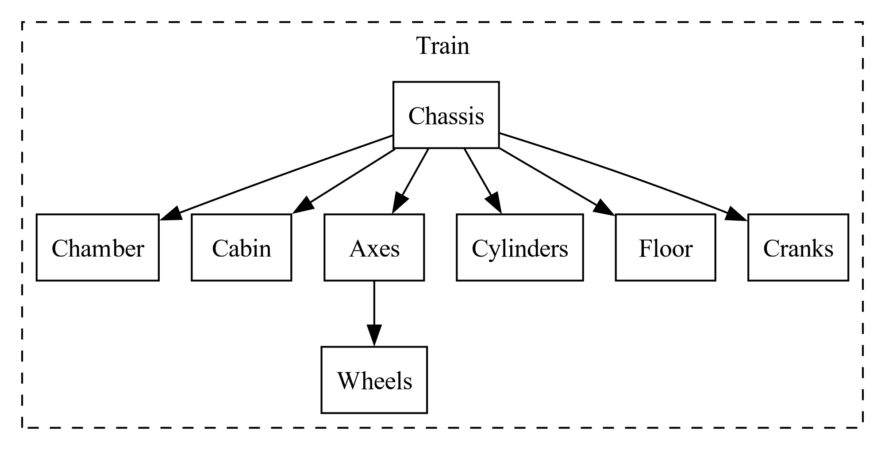

# Trabajo Practico Sistemas Gráficos

El trabajo practico consiste en implementar una escena en 3D en
[WebGL](https://www.khronos.org/webgl/) utilizando la librería de JavaScript
[Three.js](https://threejs.org/)

## Inicio Rápido

Clone el repositorio con el siguiente comando:

```console
$ git clone https://github.com/mjkloeckner/86.43.git
```

Navegue al directorio del repositorio clonado y posteriormente a la carpeta del
trabajo práctico

```console
$ cd 86.43/tp/
```

Instale las dependencias

```console
$ npm i
```

Finalmente inicialice un servidor Web en el directorio del trabajo práctico y
abra su navegador de internet preferido en la `url` especificada por `vite`

```console
$ vite
```

## Dependencias

* Un navegador que soporte [WebGL](https://get.webgl.org/)
* [Node.js](https://nodejs.org/)
* [npm](https://www.npmjs.com/)
* [vite](https://www.npmjs.com/package/vite)

## Elementos de la escena

* [X] Terreno
* [X] Arboles
* [X] Vias de Tren
    - [X] Crear el terraplen
    - [X] Crear las vias
    - [ ] Aplicar textura difusa
* [X] Locomotora
* [ ] Puente
* [ ] Túnel
* [ ] Cámaras
    - [X] Orbital general
    - [ ] Fija, locomotora frontal (desde la cabina hacia adelante)
    - [ ] Fija, locomotora trasera (desde la cabina hacia atrás)
    - [ ] Fija, con vistas al interior del túnel
    - [ ] Fija, con vistas al interior del puente
    - [ ] Primera persona (debe poder moverse sobre el terreno con el teclado y el mouse)
* [X] Texturas
* [ ] Iluminación

### Terreno

Para generar la geometría del terreno se utiliza un mapa de elevación el cual se
puede encontrar en [`assets/elevationMap.png`](./assets/elevationMap.png), luego
para la textura del terreno se utiliza 3 texturas diferentes, las cuales
se utilizan en el terreno de acuerdo a la elevación del mismo.

Para utilizar la misma textura varias veces y evitar que se note la repetición,
se utiliza la función Ruido de Perlin para obtener valores pseudo-aleatorios.

### Arboles

Los arboles se generan de manera aleatoria en todo el mapa, y se utiliza el mapa
de elevación para verificar que no caiga en un punto muy bajo o muy alto, como
puede ser montaña o rió, de acuerdo a un parámetro fijo

### Terraplén y Vías de Tren

Para dibujar las vías del tren se utiliza la función
[`ParametricGeometry`](https://threejs.org/docs/index.html?q=param#examples/en/geometries/ParametricGeometry)
de `three.js`, la cual genera una geometría a partir de una función paramétrica
que recibe tres parámetros: `u`, `v` y un vector en espacio 3D.

### Locomotora

A continuación se muestra el árbol de dependencias de los objetos que componen
la locomotora



Para realizar cada objeto de la locomotora se utilizan funciones primitivas de `three.js` tales como
[`BoxGeometry`](https://threejs.org/docs/index.html?q=box#api/en/geometries/BoxGeometry) o
[`CylinderGeometry`](https://threejs.org/docs/index.html?q=cylin#api/en/geometries/CylinderGeometry),
las cuales generan cubos y cilindros, respectivamente.

### Puente

### Túnel

### Cámaras

### Texturas

### Iluminación

## Recursos Consultados

* [Documentación de Three.js](https://threejs.org/docs/index.html#manual/en/introduction/Creating-a-scene)
